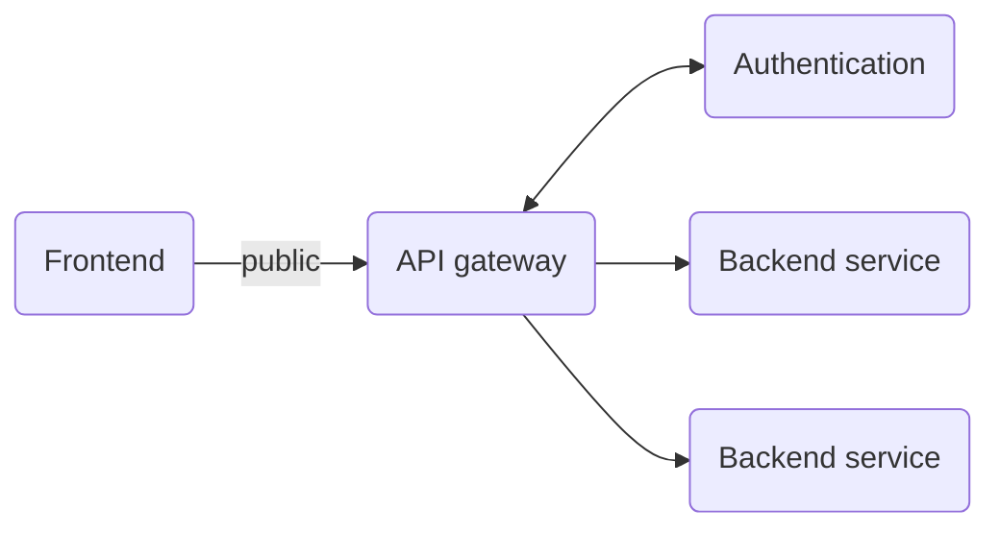
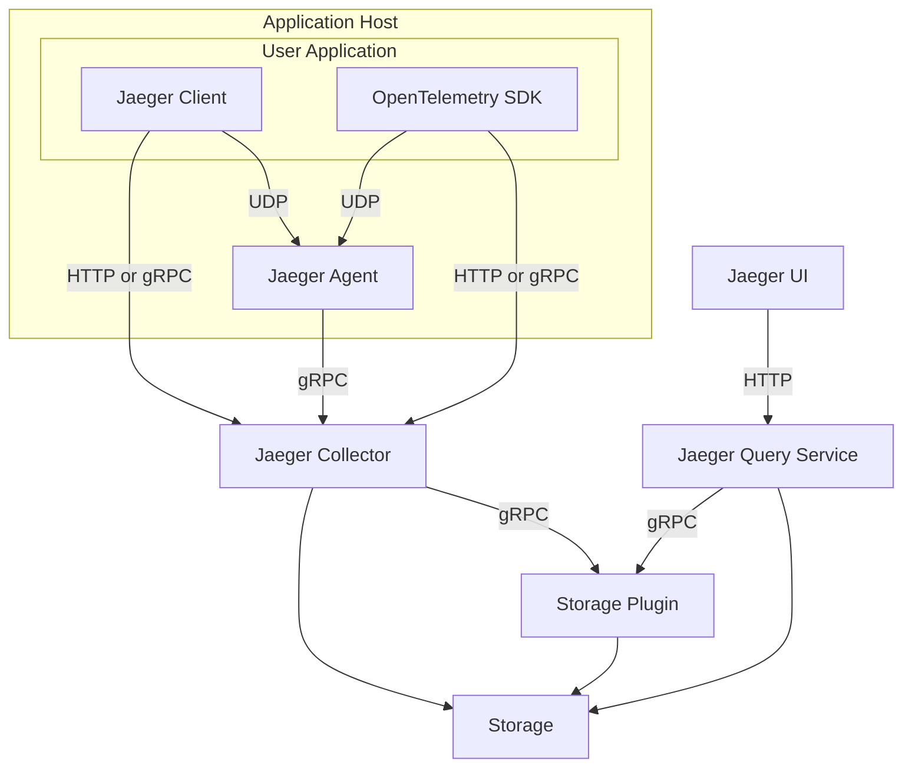

# Reference template for microservice architecture apps

## Abstract and architecture

This is a reference repository for a typical modern cloud application. The project is broken down into several backend services and the frontend service. The backend services are services that provide application logic and frontend is a siplay service that allows users to interface with all the various backend services throiugh one coherent GUI. Backends referes to all backend services (including authentication). Each of the backend services can be interfaced with via a single URL which is achieved by an API gateway (a reverse-proxy server) which sits in front of all the backends and handles routing to the correct service and implements route protection. The frontend is a display layer which provides a single interface with which users may interact with the application through a GUI.

The application architecture is depicted bellow:
<!-- TODO: Add a reference architecture diagram -->


Application architecture within the context of Kubernetes

Application architecture within the context of GCP

## Why a microservice architecture
- allows for non-uniform scalling

## Design decisions
In order to promote best design practices we have a log which forces is us to record each design desision and justify in order to follow best practices and provide a generalised solution...
This is a log of the design decions for the template repository in order to force me to justify why a decision was made
- For develeopment fully orchestrated with docker compose to make life easier for devs
- all in one repository (monorep microservice application) so that engineers can see the whole codebase and make more informed design decisions
- custom reverse-proxy/api gateway to not be tied to a cloud provider
- Infra as code so as to version control infrastrucrure and create more robust understandable systems
- route protection by default - all services are protected other than the aut service which by definition cxan't be protected
- document each service locally within the service directory - means that the documentation is naturally organised by the repository structure and broken down into manageable chunks per service + quick to access when working on the service

## Setting up the repository for development

### Orchestration

One of the diffciulties when working with microserviuces is that there are many moving components that are required to make the app run - this can get in the way of developmnent as some services may have dependencies on other services in order for them to be worked on. You could run each service locally on the machine in different shell sessions but this can quickly become tedious specially if the architetcure has many services. This is where an automated orchestration tool can be of use. An orchestration tool 'orchestrates' all the different services. It records their dependencies and allows them to communicate with each other. It is used to build all the necessery copnents of the application and bring them up together so that they can communicate with one another. In addition, all teh application logs are aggregated into one shell which makes debugging easier. An orchestration tool such a docker-compose, which is geared towards local orchestration for developes can be an easy way to orchestrate your mciroservices on development machines.

Build each of the services with:
```bash
docker compose -f compose-dev.yml build
```

Then, bring the whole application up with:
```bash
docker compose -f compose-dev.yml up
```

Exit the session with `ctrl+c`

And bring all the services down with
```bash
docker compose -f compose-dev.yml down
```


### Testing the API

There are many way to develop and test an API. You can use excelent tools such as postman with GUIs but the simplest way is to just use the `cURL` programme pre-installed on most unix machines. 

test curl commands for the api

curl -X POST -v -H "Content-Type: application/json" -d '{"username": "[USERNAME]", "password": "[PASSWORD]"}' http://localhost:8000/auth/signup


curl -X POST -v -H "Content-Type: application/json" -d '{"username": "[USERNAME]", "password": "[PASSWORD]"}' http://localhost:8000/auth/signin

```bash
curl -v --cookie "session_token=[TOKEN]" http://localhost:8000/auth/test
```


Integrating with IDE tooling when working with a containerised microservice app - this is a paine

## Going into production

While microservice architectures have many benefits they are tricker to work with both in development and production because of the need for orchestration and managing dependencies between each of the services.

While docker-compose works well in the context of development it is limited to running each service on the same machine. This is where Kubernetes comes in - its function is the same as docker compose: orchestration but is able to spread computation across a cluster of machines.

Generating the kubernetes manifest files from the compose-prod.yml configuration (remove debugging services and settings)
```bash
kompose convert -f compose-dev.yml -o ./orch/
```

**How to setup kub with minikube using local images for messing around with kub?**
As the handbook describes, you can reuse the Docker daemon from Minikube with eval $(minikube docker-env).

So to use an image without uploading it, you can follow these steps:

Set the environment variables with eval $(minikube docker-env)
Build the image with the Docker daemon of Minikube (eg docker build -t my-image .)
Set the image in the pod spec like the build tag (eg my-image)
Set the imagePullPolicy to Never, otherwise Kubernetes will try to download the image.
Important note: You have to run eval $(minikube docker-env) on each terminal you want to use, since it only sets the environment variables for the current shell session.

Source: https://stackoverflow.com/questions/42564058/how-to-use-local-docker-images-with-minikube


TODO: move away from compose and use minikube (local kubernetes cluster) + skaffold instead
Basically get rid of docker-compose for local orchestration during dev as it makes the transition from the dev environment to kubernetects orchestration too difficult - instead use a local kubernetes tool e.g. minikube + skaffold to manage many builds at once (which basically covers the full use of docker-compose + it means we only need to manage kub manifest files and not docker compose + kub manifest files)
https://loft.sh/blog/docker-compose-alternatives-for-kubernetes-skaffold/


The skaffold is used to build all the custome images + run all the images needed for local development

Great example architecture diagram



Maybe just use compose cause its easier and then have a separate repo for kub manifest file


everything in the release directory should typically be kept in another highly restricted repo to keep track of the exact production orchestration parametere and production keys
Use a dev cluster to replicate the production environkment just to test that theree is no issue (e.g. misconfiguration)


This is another good resource - https://github.com/GoogleCloudPlatform/microservices-demo

Is microservice really better? - the thought that has been plaguing me since i've started working with them


Pushing the images to gcp
Pre-requist: have cloud sdk installed 

```bash
gcloud auth login
```

```bash
gcloud auth configure-docker
```


Using skaffold is pretty cool and can be an alternative to using compose locally for development but it requires developers to manage manifest files and hence requires a greater overhead than using a simple compose file - so in the context of teh develpment repo probably best to just use compose and then have another devops repo used to manege the release manifest files and ci/cd stuff


Do not used the default VPC for a production system - make a new one and create regional subnetworks as desired and firewall rules to only allow ingress on specified ports

Obviously don't store secrete objects in your dev repository - ./release-orch/_auth_db-secret.yaml should be placed in a secret repository and pulled into the production system

dev cluster and prod cluster